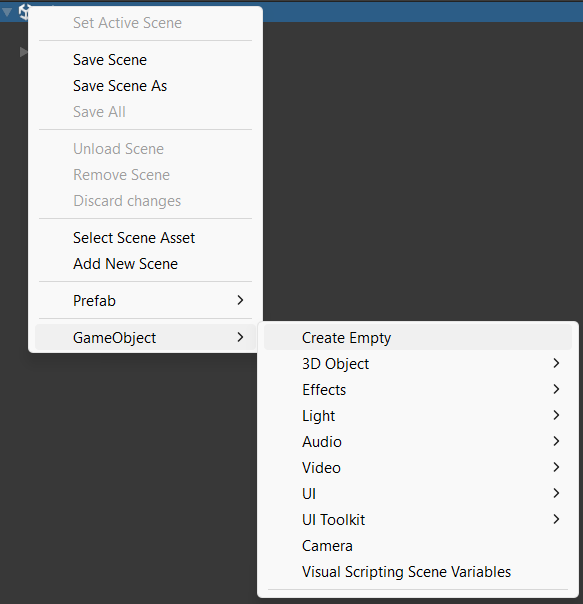

You can add spheres, cubes, cylinders, and other 3D shapes to a scene. 

Right-click in the Hierarchy window and create an **Empty** 3D Object to act as a container for the whole item. 

Right-click on the new empty GameObject and add shapes as child GameObjects. You can position child objects relative to the parent so that they will move with the parent if you reposition it. 

