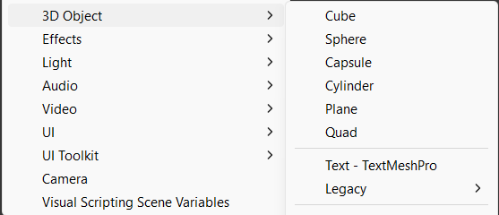
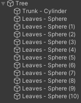

You can add spheres, cubes, cylinders and other 3D shapes to a scene. 

Right-click in the Hierarchy and choose '3D Object' and then the shape of your choice. 

You can also right-click on a shape in the Hierarchy and add more shapes as child objects. You can position child objects relative to the parent so that they will move with the parent if you reposition it. 

