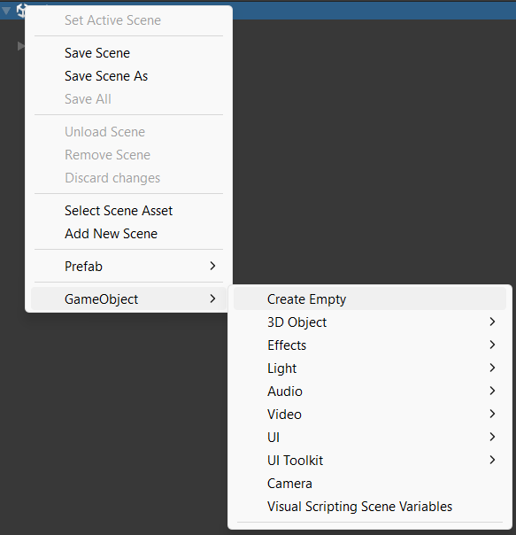

Tu peux ajouter des sphères, des cubes, des cylindres et d'autres formes 3D à une scène.

Fais un clic droit dans la fenêtre Hierarchy et crée un 3D Object **Vide** qui servira de conteneur à l'ensemble de l'article.

Fais un clic droit sur le nouveau GameObject vide et ajoute des formes en tant que GameObjects enfants. Tu peux positionner les objets enfants par rapport au parent de façon à ce qu'ils se déplacent avec le parent si tu le repositionnes.

