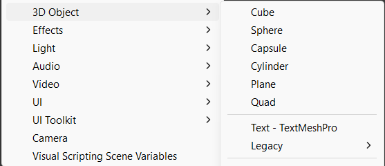

You can add spheres, cubes, cylinders, and other 3D shapes to a scene.

Right-click in the Hierarchy window and create an **Empty** 3D Object to act as a container for the whole item.

Klik met de rechtermuisknop op het nieuwe empty GameObject en voeg vormen toe als onderliggende GameObjects. Je kunt onderliggende objecten ten opzichte van de bovenliggende positioneren, zodat ze meebewegen met de bovenliggende als je deze verplaatst.

